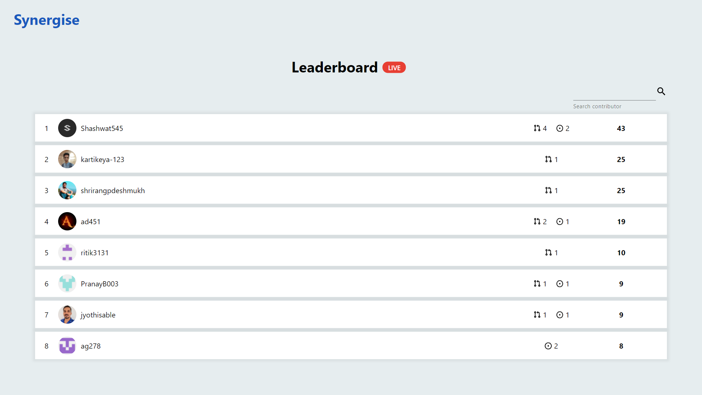
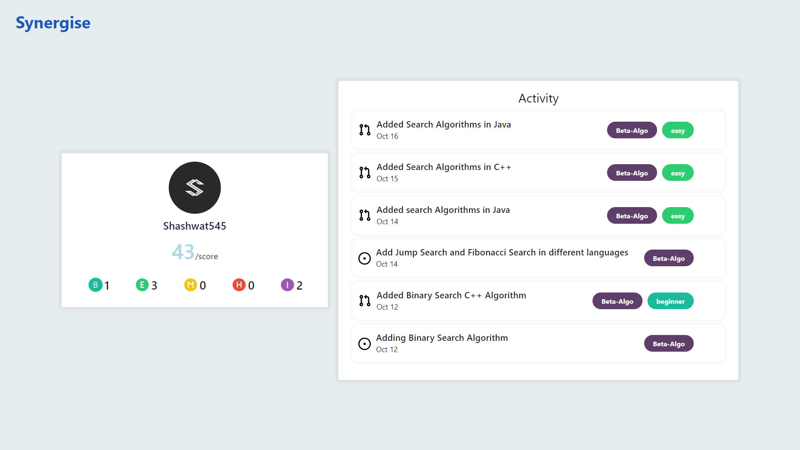

## Synergise Points Tracker

This is a web app created using ReactJS for tracking the contributions made during **Synergise**.

Synergise is an initiative by Neuromancers and GDSC IIT Bhubaneswar to nurture students with minimal experience in Free and Open-Source Software (FOSS) development.

### Features

- The web app keeps track of merged pull requests and issues created by the contributors using GitHub API and specific tags.
- Students are allotted points based on the difficulty assigned to the PR by the project maintainer using the tags and the number of issues they have created, which the maintainer accepts.
- Details of how the user scored the total points can be seen on the specific user page.
- Webapp also supports searching the contributor using their GitHub ids.
- The web app is completely responsive for all screen sizes.
   

   

#### Contributors

- [P Kartikeya](https://www.linkedin.com/in/kartikeya-pochampalli-29a0a319b/)
- [Sai Krishna Jupally](https://www.linkedin.com/in/sai-krishna-jupally-b7050177/)
- [Shrirang Deshmukh](https://www.linkedin.com/in/shrirang-deshmukh/)
